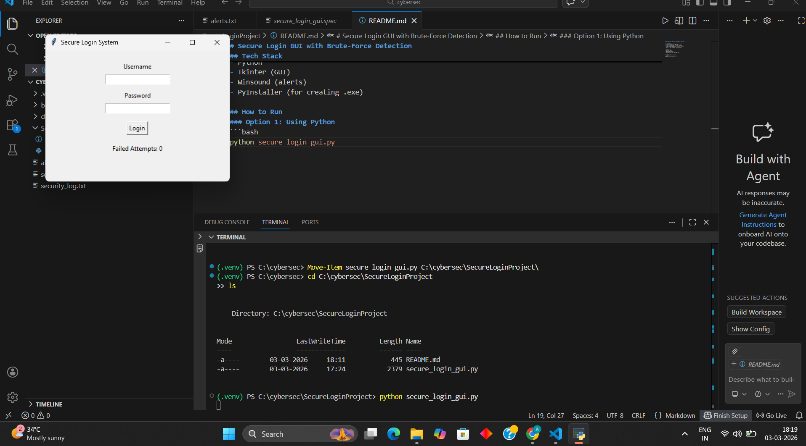
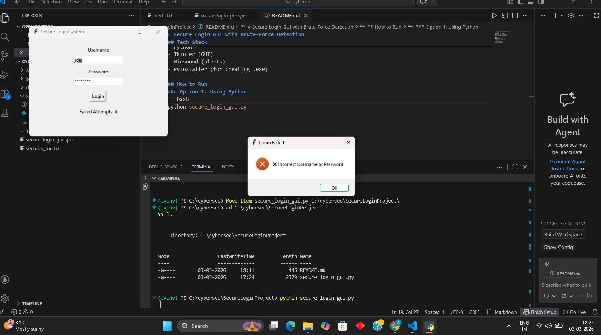
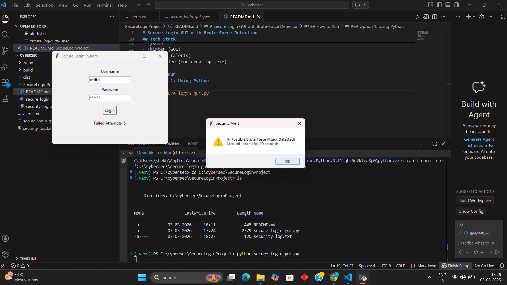
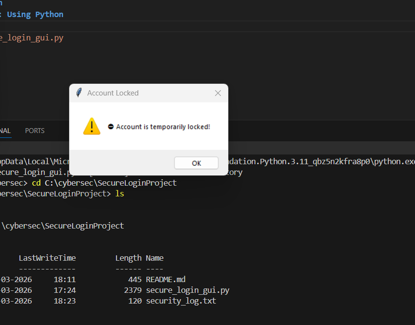
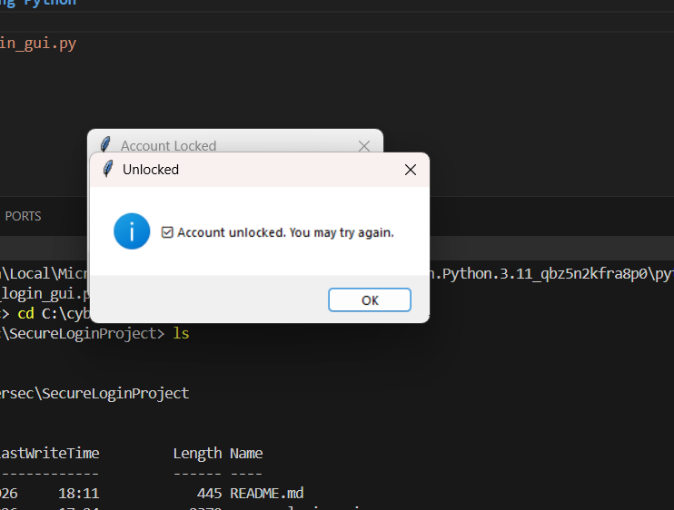
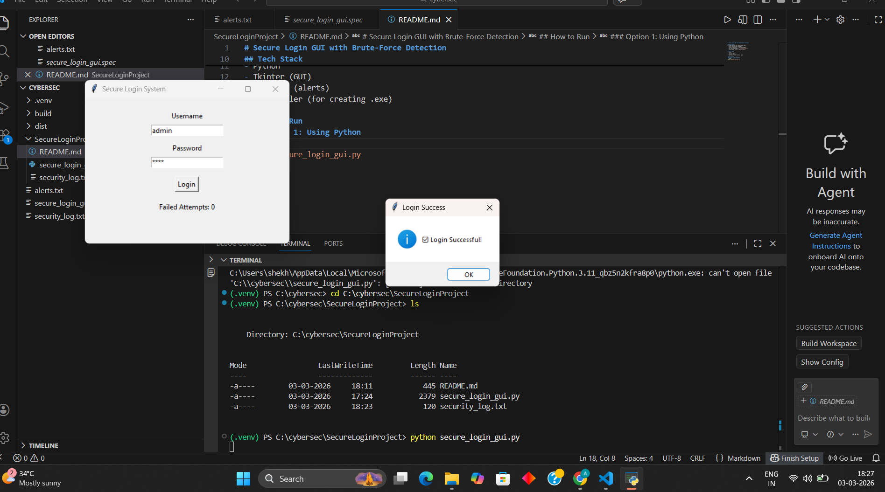

# Secure Login GUI with Brute-Force Detection

## Description
A Python Tkinter GUI login system that:
- Tracks failed login attempts
- Locks account after 5 failed attempts
- Logs failed attempts to `security_log.txt`
- Emits a beep sound on security alert

## Tech Stack
- Python
- Tkinter (GUI)
- Winsound (alerts)
- PyInstaller (for creating .exe)

## How to Run
### Option 1: Using Python
```bash
python secure_login_gui.py

## Screenshots






